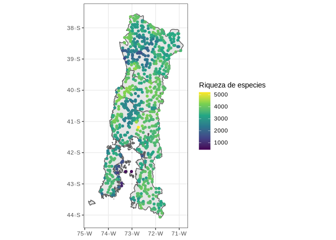
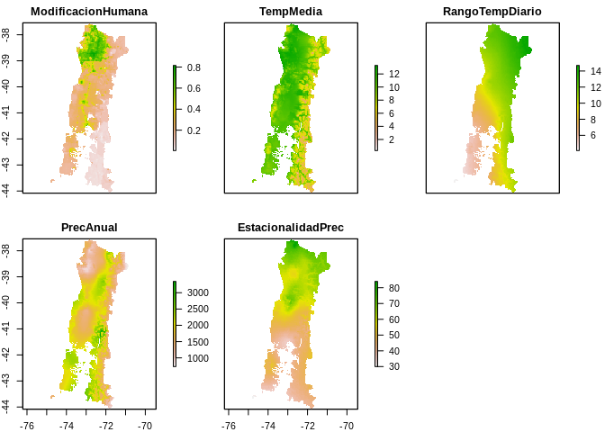

Proyecto final
================

# 1 Objetivo

El objetivo del trabajo final es el realizar una presentación grupal,
donde usando las bases de datos entregadas, generen el mejor modelo
posible para explicar los patrones de Riqueza de especies de aves
encontrados en el sur de Chile, en las regiones de Araucanía, Los Lagos
y Los Ríos (ver figura <a href="#fig:Diversidad">1.1</a>). Los datos del
número de especies en cada uno de los sitos puede ser encontrado en el
archivo `Diversidad.shp`. Para esto y como variables disponibles pueden
usar la base de datos espaciales `Stack.rds`, los cuales pueden ser
visualizados en la figura <a href="#fig:Variables">1.2</a>. Las
variables en este stack son el indice de modificación humana (Kennedy et
al. 2019) y por otro lado la variables bioclimáticas temperatura media
anual, el rango térmico diario, la precipitación anual y la
estacionalidad de la precipitación descargadas desde worlclim usando el
paquete raster en R (Hijmans 2020). Si bien esas son las variables
entregadas, no es necesario que se restrinjan a solo utilizar estas y
pueden agregar otras que crean
importantes.

Figura 1.1: Número de especies de aves en el sur de Chile de acuerdo a
la distribución de especies determinada por la
IUCN

Figura 1.2: Mapa con las variables explicativas, las cuales consideran
el indice de modificación humana, temperatura media anual, el rango
térmico diario, la precipitación anual y la estacionalidad de la
precipitación

# 2 Instrucciones

## 2.1 Requisitos mínimos de presentación

  - Presentación de 10 minutos vía Zoom
  - Probar distintos modelos y seleccionar en base a lo visto en clases
  - Entre los resultados entregados deben tener un raster para el área
    realizados en base a una
    [interpolación](https://youtu.be/AjWvI9P6jos)
  - Intenten modelos que no solo incluyan relaciones lineales

# 3 Grupos de trabajo

En la tabla <a href="#tab:Grupos">3.1</a>, se encuentran los grupos de
trabajo y los horarios de
presentaciones

| Nombre                                | email                                    | Grupo | Presentacion        |
| :------------------------------------ | :--------------------------------------- | ----: | :------------------ |
| Pereda Quilapán, Marcelo Adolfo       | <marcelo.pereda@alumnos.uach.cl>         |     1 | 2021-01-19 16:30:00 |
| Ravanal Padilla, Rodrigo Andres       | <rodrigo.ravanal@alumnos.uach.cl>        |     1 | 2021-01-19 16:30:00 |
| Segovia Oyarzo, Luis José             | <luis.segovia@alumnos.uach.cl>           |     1 | 2021-01-19 16:30:00 |
| Calderón Fati, José Julio Haumaru     | <jose.calderon@alumnos.uach.cl>          |     2 | 2021-01-19 16:50:00 |
| Escalona Álvarez, Pablo Andrés        | <pablo.escalona@alumnos.uach.cl>         |     2 | 2021-01-19 16:50:00 |
| Neira Becerra, Valentina Constanza    | <valentina.neira@alumnos.uach.cl>        |     2 | 2021-01-19 16:50:00 |
| Arzola Cisterna, Scarlett María       | <scarlett.arzola@alumnos.uach.cl>        |     3 | 2021-01-19 17:10:00 |
| Luco Molina, Carlos Alberto           | <carlos.luco@alumnos.uach.cl>            |     3 | 2021-01-19 17:10:00 |
| Ulloa Vera, Carla Andrea              | <carla.ulloa@alumnos.uach.cl>            |     3 | 2021-01-19 17:10:00 |
| Cocio González, Fernanda Jesús        | <fernanda.cocio@alumnos.uach.cl>         |     4 | 2021-01-19 17:30:00 |
| Donoso Venegas, Diego Esteban         | <diego.donoso01@alumnos.uach.cl>         |     4 | 2021-01-19 17:30:00 |
| Gutierrez Aguila, Angela Mariluz      | <angela.gutierrez@alumnos.uach.cl>       |     4 | 2021-01-19 17:30:00 |
| Castro Maldonado, Sebastián Ignacio   | <sebastian.castro@alumnos.uach.cl>       |     5 | 2021-01-19 17:50:00 |
| Inzunza Riquelme, Danko Arturo        | <danko.inzunza@alumnos.uach.cl>          |     5 | 2021-01-19 17:50:00 |
| Pizarro Barrera, Ricardo Antonio      | <ricardo.pizarro@alumnos.uach.cl>        |     5 | 2021-01-19 17:50:00 |
| Bañares Mansilla, Angie Javiera       | <angie.banares@alumnos.uach.cl>          |     6 | 2021-01-19 18:10:00 |
| Ramírez Águila, Kamila Andrea         | <kamila.ramirez@alumnos.uach.cl>         |     6 | 2021-01-19 18:10:00 |
| Rodríguez Oyarzo, María Teresa        | <maria.rodriguez@alumnos.uach.cl>        |     6 | 2021-01-19 18:10:00 |
| Alvarado Subiabre, Guillermo Ignacio  | <guillermo.alvarado@alumnos.uach.cl>     |     7 | 2021-01-19 18:30:00 |
| Lara Riquelme, Bárbara Escarlen       | <barbara.lara@alumnos.uach.cl>           |     7 | 2021-01-19 18:30:00 |
| Luco Molina, Macarena Alejandra       | <macarena.luco@alumnos.uach.cl>          |     7 | 2021-01-19 18:30:00 |
| Cubillos Inostroza, Diego Exequiel    | <diego.cubillos@alumnos.uach.cl>         |     8 | 2021-01-19 18:50:00 |
| Gatica Fuentealba, Nicolas Ignacio    | <nicolas.gatica@alumnos.uach.cl>         |     8 | 2021-01-19 18:50:00 |
| Valenzuela Ampuero, Sebastián Eduardo | <sebastian.valenzuela04@alumnos.uach.cl> |     8 | 2021-01-19 18:50:00 |

Tabla 3.1: Grupos de trabajo

# 4 Material extra disponible

  - Si quieren generar una presentación de forma reproducible (no es
    obligatorio), pueden ver la siguiente [guía
    online](https://bookdown.org/yihui/rmarkdown/presentations.html) y/o
    ver el siguiente
video

<iframe width="560" height="315" src="https://www.youtube.com/embed/2fg_X0d6SRA" frameborder="0" allow="accelerometer; autoplay; clipboard-write; encrypted-media; gyroscope; picture-in-picture" allowfullscreen>

</iframe>

  - Pueden encontrar más datos espaciales en el siguiente
    [link](https://gisgeography.com/best-free-gis-data-sources-raster-vector/)
  - Otros tutoriales espaciales
    [interesantes](https://youtu.be/dQw4w9WgXcQ)

# 5 Referencias

Hijmans, Robert J. 2020. *Raster: Geographic Data Analysis and
Modeling*. <https://CRAN.R-project.org/package=raster>.

Kennedy, Christina M, James R Oakleaf, David M Theobald, Sharon
Baruch-Mordo, and Joseph Kiesecker. 2019. “Managing the Middle: A Shift
in Conservation Priorities Based on the Global Human Modification
Gradient.” *Global Change Biology* 25 (3). Wiley Online Library: 811–26.

